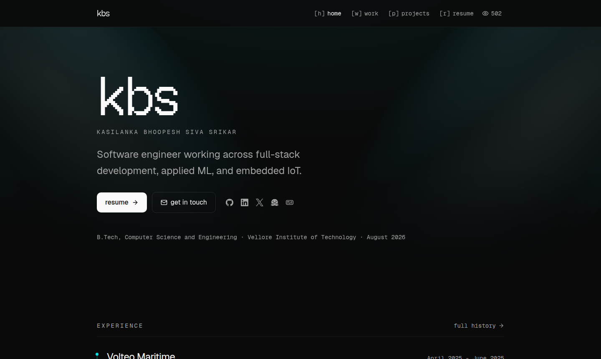
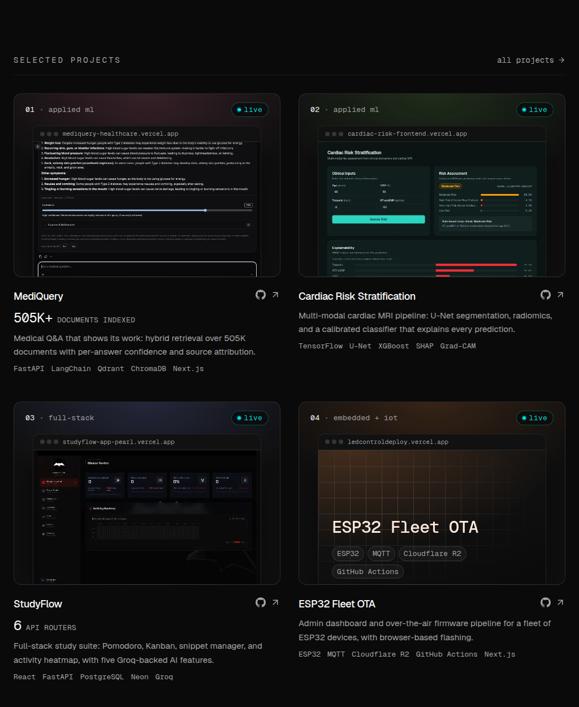
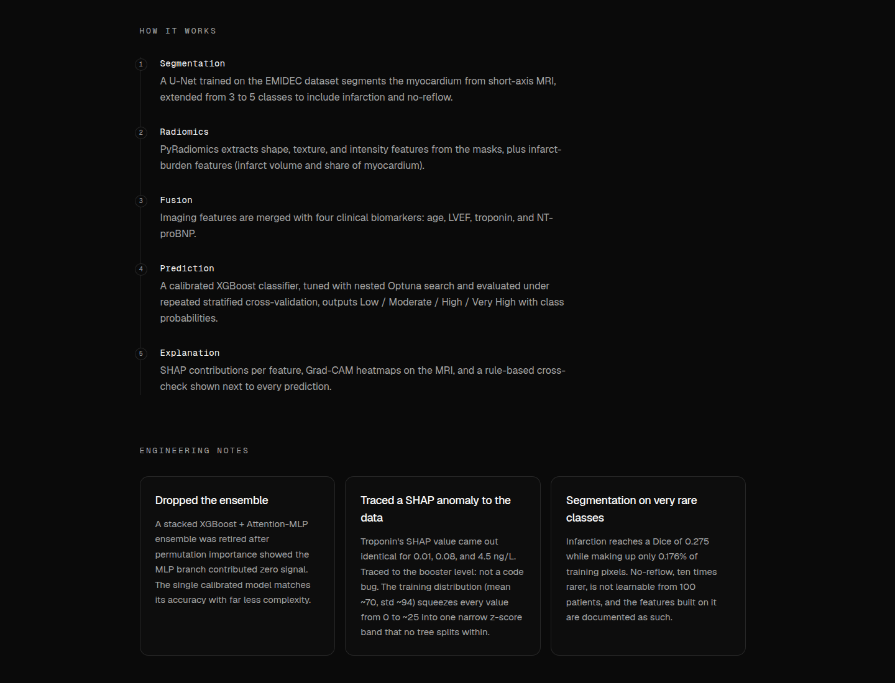

# K.B.S Srikar - Developer Portfolio

The developer portfolio of **K.B.S Srikar**, a software engineer working across
full-stack development, applied ML, and embedded IoT.

**Live: [kbssrikar7.github.io](https://kbssrikar7.github.io)**



## Features

- **Project cards** - every project screenshot sits in the same browser frame on a
  panel tinted with that project's colour, with its headline metric and a
  cursor-following glow on hover.
- **Real demo screenshots** - a Puppeteer script drives each live demo to real
  output before capturing it (a RAG answer with its confidence score, a risk
  assessment, a solved equation), instead of an empty form.
- **Project write-ups** - how each system works, the engineering decisions behind
  it, and its known limits, taken from the project's own repo.
- **Scramble-decode name** in the hero, a command palette (<kbd>⌘K</kbd>), and
  single-key navigation (`h` `w` `p` `r`).
- **Page transitions** - the card screenshot morphs into the project page with the
  View Transitions API.
- **Fast and indexable** - static export, 0 layout shift, responsive images on a
  host with no image optimizer, Person / project / breadcrumb structured data, and
  per-page Open Graph cards. Lighthouse 100 on accessibility, best practices and SEO.





## Stack

- **Framework** - [Next.js 16](https://nextjs.org) (App Router, static export) and React 19
- **Styling** - [Tailwind CSS v4](https://tailwindcss.com), [shadcn/ui](https://ui.shadcn.com),
  and [Aceternity UI](https://ui.aceternity.com) for the hero spotlight
- **Motion** - [`motion`](https://motion.dev), CSS animations, View Transitions
- **Type** - Geist Sans, Geist Mono, and Geist Pixel
- **Tooling** - TypeScript, Vitest, Puppeteer, and [TypeSafe](https://typesafe.ai)
  for build-time project ranking
- **Hosting** - GitHub Pages (canonical), with a Vercel mirror

## Local

```bash
npm install
npm run dev
npm run build     # -> out/ , then fixes OG image extensions
npm run lint
npm run typecheck
npm run test
```

## Content pipeline

Three things are generated ahead of time and **committed**, so CI needs no secrets
and no network access to third-party demo sites.

### 1. Project ranking - `npm run curate`

Sends each public repo to the [TypeSafe](https://typesafe.ai) System One API and asks
three questions in one request:

| Question | Type | Used for |
| --- | --- | --- |
| `worthiness` | Score | Ordering, and which projects are featured |
| `bucket` | Choice | The category filter chips |
| `demoable` | Noul | Whether a card shows the "live" badge |

Output lands in `src/data/projects.curated.json`. Run `npm run curate -- --dry-run`
to see the ranking without writing.

The model ranks; it never writes copy. All prose lives in `src/data/projects.manual.ts`
and always wins on merge (`src/lib/projects.ts`). Two projects are pinned to featured
by hand where the ranking under-rated them - see `FEATURED_PINS`.

Requires `TYPESAFE_API_KEY` in `.env.local` (gitignored).

### 2. Preview images - `npm run shots`

Uses `puppeteer-core` against the system Chrome (no bundled browser download).
Three tiers:

1. **Live capture** for projects with a working demo. Handles Streamlit's
   "app has gone to sleep" interstitial by clicking through and waiting. Demos
   that only show something after input have a `PREPARE` step in the script
   (ask MediQuery a question, run a risk assessment, solve a sample, calculate
   a cost) so the capture shows real output, not an empty form.
2. **README pull** for repos that ship their own screenshots, letterboxed onto the
   same canvas so the grid stays uniform. Wins over a live capture when set -
   used where the live app opens on a login screen.
3. **Generated cover** for everything else - rendered in the DOM
   (`components/project/generated-cover.tsx`), not as a file. Demos behind a
   login with no README screenshot are listed in `LOGIN_WALLED` and land here.

Writes `public/previews/*.webp` plus a `manifest.json`. A demo that fails keeps
its previous image; files nothing references any more are deleted.

### 3. OG images - automatic at build

`opengraph-image.tsx` per route, rendered by Satori via `next/og`, giving every
project its own social card. Two constraints worth knowing:

- Every `opengraph-image.tsx` **must** `export const dynamic = 'force-static'`, or the
  static export refuses to prerender it.
- Satori cannot read variable fonts or woff2. Geist Sans/Mono ship static `.ttf`, so
  those load from `node_modules`. **Geist Pixel ships woff2 only**, so it was decompressed
  once and committed to `assets/GeistPixel-Square.ttf`:

  ```bash
  .venv/bin/fonttools ttLib.woff2 decompress <geist-pixel woff2>
  ```

Next emits metadata images as extensionless files, which GitHub Pages would serve as
`application/octet-stream` and every crawler would reject. `scripts/fix-og.mjs` runs
after each build to add `.png` and repoint the HTML, the RSC payloads (`.txt`, used on client-side
navigation) and the web manifest. It anchors its rewrite to URL
paths - matching the bare names anywhere in the HTML would turn `rel="icon"` into
`rel="icon.png"`.

### 4. Favicon - `npm run favicon`

`app/icon.tsx` covers modern browsers via `<link rel="icon">`. Some older crawlers
request `/favicon.ico` regardless, so `scripts/make-favicon.py` converts the rendered
icon into a real multi-size `.ico` at `public/favicon.ico`.

Needs a build first (it reads `out/icon.png`) and is committed, since CI has no Python.
Nothing detects drift, so re-run it if the mark in `app/icon.tsx` changes.

## Deploying

Pushing to `main` triggers `.github/workflows/deploy.yml`, which lints, typechecks,
tests, then builds and publishes the static export to GitHub Pages. **This is the
canonical deployment** - `profile.siteUrl` and every `alternates.canonical` tag point
at it.

**One-time manual step:** repo Settings → Pages → Source → **GitHub Actions**.
Without it the deploy fails with an unhelpful error.

### Vercel mirror

The same repo is also connected to Vercel (auto-deploys on push via its GitHub
integration; `vercel.json` just pins the build command and framework).
`next.config.ts` branches on `process.env.VERCEL`
so each host gets the mode it needs: GitHub Pages gets `output: 'export'` plus
`trailingSlash: true` and unoptimized images; Vercel gets Next's normal SSR/ISR build
with real image optimization. `profile.deployedUrl` resolves to whichever host actually
served the current build, so OG images and metadata are always self-consistent - but
`alternates.canonical` always points back at the GitHub Pages URL regardless of which
host is serving, since that's the one URL meant to be indexed.

## Analytics

Optional, via [Umami](https://umami.is). The `<Script>` tag in `layout.tsx` no-ops
until `NEXT_PUBLIC_UMAMI_SRC` and `NEXT_PUBLIC_UMAMI_WEBSITE_ID` are set (see
`.env.example`). To turn it on:

1. Create a website in your Umami instance (self-hosted or umami.is cloud) and copy
   its tracking script URL and website ID.
2. GitHub Pages build: repo Settings → Secrets and variables → Actions → **Variables**
   → add both as repo variables (they're public analytics IDs, not secrets).
3. Vercel build: add both as a Project → Settings → Environment Variables.

### Visitor count

The nav bar shows a live visitor count (`components/site/visitor-count.tsx`), via
[countapi.mileshilliard.com](https://countapi.mileshilliard.com) - a free, no-signup,
no-API-key hit counter. There's nothing secret involved (unlike Umami's stats API,
which needs a paid Pro plan to expose even one number), so this is a plain
client-side fetch with no server route behind it. To make it appear fast, the request
starts from an inline `<head>` script (so it runs while the JS bundle downloads, not after
hydration), the origin is preconnected, and the last value is cached in `localStorage` so
repeat visitors see a number immediately. It counts page loads, not unique
visitors, and ad blockers sometimes flag counter services as trackers and block the
request - both accepted tradeoffs of the free option, same as any GitHub-README
visitor badge.

Clicking the count opens the site's public Umami dashboard, if configured: in Umami,
open this website's settings and enable **Share URL**, then set
`NEXT_PUBLIC_UMAMI_SHARE_URL` (same three places as the analytics vars above). Without
it, the count still shows, just isn't a link.

## Search Console

The site is verified in Google Search Console with the **HTML file** method:
`public/google7a6345abb1345e2e.html` is served at the site root. Do not delete it,
or the property loses its verified status. The sitemap
(`https://kbssrikar7.github.io/sitemap.xml`) is submitted there.

The layout can also emit a verification meta tag: set
`NEXT_PUBLIC_GOOGLE_SITE_VERIFICATION` (a GitHub Actions repository variable for
Pages, a Vercel environment variable for the mirror) to the token from the
**HTML tag** method. It is only needed if a second verification method is wanted.

## License

[MIT](LICENSE)
